# Making scripts interactive and observable - Hands-on Guide

## The interactive script

1. Clone the GitHub repo on your system and select the "hands-on" branch.
1. Open `Skyline.DataMiner.Learning.MakingMaintenanceObservable.sln` in Visual Studio 2022 or Visual Studio 2026.
1. Link the Toolkit (already linked):

   1. Be sure to select the `Manage Maintenance (Learning)` script project.
   1. Click *Project* > *Manage NuGet Packages*
   1. Verify that the [Skyline.DataMiner.Utils.InteractiveAutomationScriptToolkit](https://www.nuget.org/packages/Skyline.DataMiner.Utils.InteractiveAutomationScriptToolkit) NuGet is selected.

      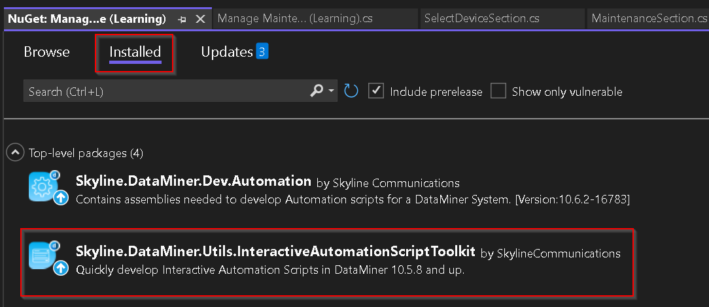

      > **Keep in mind** to select the matching version of the NuGet. The version and the description of NuGet will tell which minimum DataMiner version is required.

## Publish the script

1. Add your DaaS to DIS:
   1. *Extensions* > *DIS* > *Settings*
   1. In *DMA* tab *Add* your DaaS.

      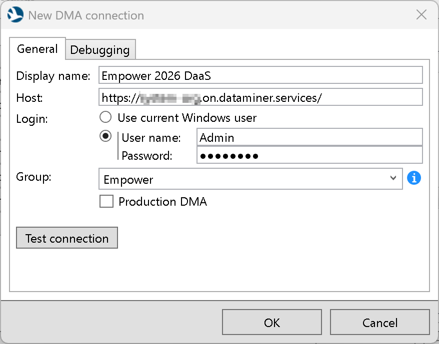

   1. Select `MakingMaintenanceObservable Package.xml` the `MakingMaintenanceObservable Package` script project.
   1. Click the down arrow next to the *Publish* button, in the bar on top, to select your DaaS.

      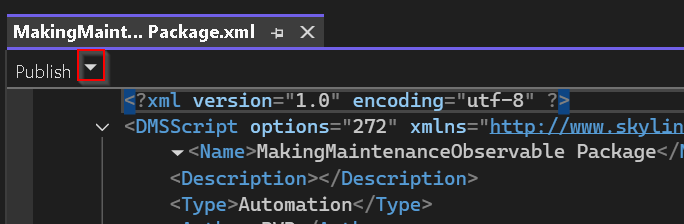

      Note: During your session this DMA should remain the selected one when clicking *Publish*.

1. Open the *Manage maintenance windows (Hands-On)* app:
   1. In the app you will see a text mentioning that the component should be replaced with the 'Interactive Automation Script' component.
   1. Duplicate the app, using the option when clicking the *...* icon in the upper right corner.

      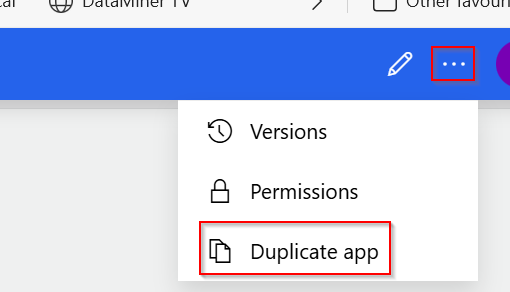

   1. Rename the app, by selecting the name in the top bar, from *Manage maintenance windows (Hands-on) (1)* to *Manage maintenance windows*.
   1. Remove the text component.
   1. Hover over the blue bar with '+' on the left end to add an *Interactive Automation Script* component.

      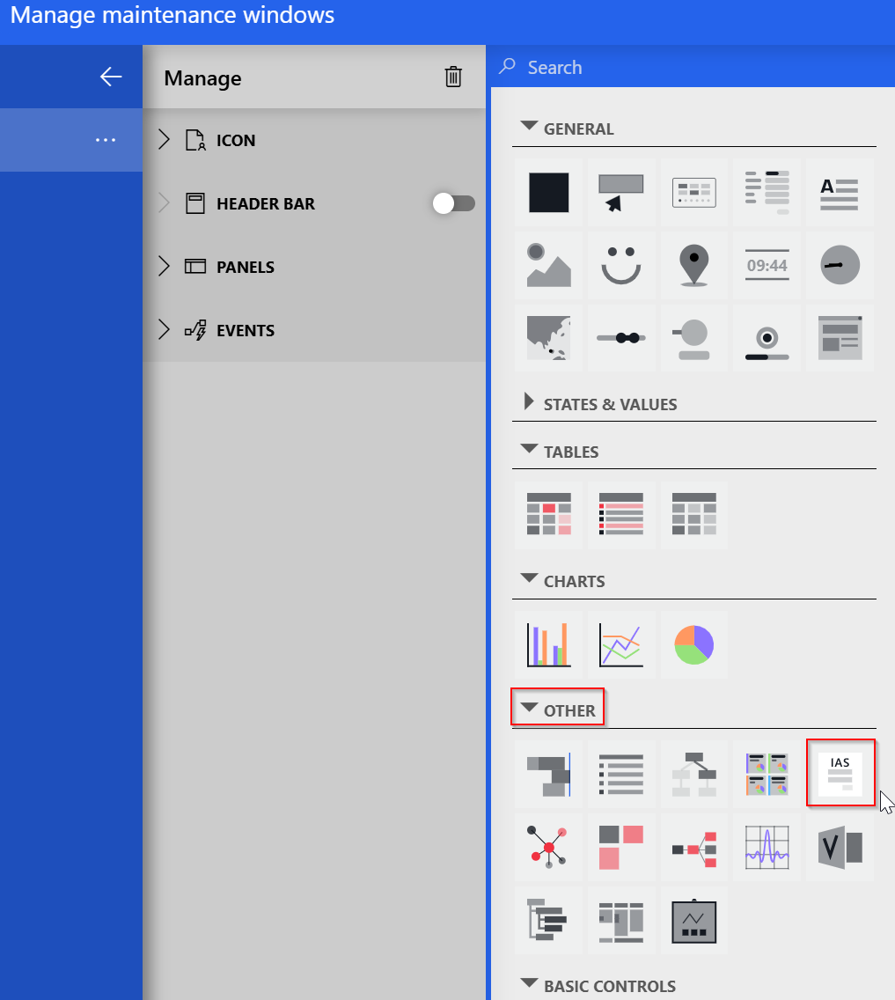

   1. Resize the *Interactive Automation Script* component so it fills the entire page.
   1. Select the component and in *Component* > *Settings* select the *Manage Maintenance (Learning)* script.
      The component requires a script that is defined as interactive.
      Since that is currently not the case for the script that was published, it will display an error stating the script should be interactive. Let's fix that.

      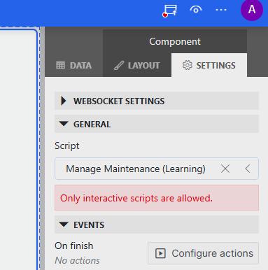

1. Update the script to be interactive:

   1. Select `Manage Maintenance (Learning).xml` in the `Manage Maintenance (Learning)` script project.
   1. Add the `<Interactivity>` element that is set to *Always*.
      - The element should be added in *DMSScript*, on the same level of the *Name* element.

        ```xml
        <Interactivity>Always</Interactivity>
        ```

        The top of `Manage Maintenance (Learning).xml` in `Manage Maintenance (Learning)` should look like this:

        ```xml
        <?xml version="1.0" encoding="utf-8" ?>
        <DMSScript options="272" xmlns="http://www.skyline.be/automation">
            <Name>Manage Maintenance (Learning)</Name>
            <Interactivity>Always</Interactivity>
            <Description></Description>
            <Type>Automation</Type>
        ```

      - This element was added in DataMiner 10.5.9.
      - By default this element will be set to *Auto*. The other options are explained in [InteractivityOptions on DataMiner Docs](https://docs.dataminer.services/develop/schemadoc/Automation/InteractivityOptions.html#content-type)
      - Before DataMiner 10.5.9 [the following comment](https://github.com/SkylineCommunications/Skyline.DataMiner.Utils.InteractiveAutomationScriptToolkit/blob/10.5.8.X/README.md?plain=1#L28) needs to be added in the run method of the script:

        ```csharp
        // engine.ShowUI();
        ```

   1. Click the *Publish* button, in the bar on top, to publish the script to your DaaS.

      

1. Return to the app in your browser to configure the `Interactive Automation Script`.
   1. Refresh (<kbd>Ctrl</kbd> + <kbd>R</kbd> / <kbd>Cmd</kbd> + <kbd>R</kbd>) the app.
   1. Select the component and in *Component* > *Settings* select the *Manage Maintenance (Learning)* script.
   1. Publish the app, using the button in the left section in the top bar.

      

1. In the app select an *Encoder A1*.
The Manage Maintenance (Learning) already shows an overview of the maintenance windows for a device that you have selected.

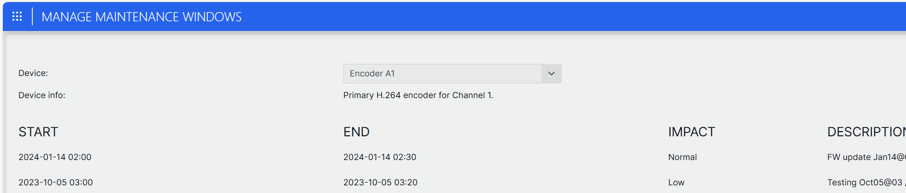

## Keep in mind

- When an interactive automation script is opened in a pop-up it will have a title bar and a close button. The 'Interactive Automation Script' component does not have those.

- The main dialog already has add, edit and delete buttons. When the script has been published using the solution in the 'hands-on', nothing will happen when these buttons are clicked. We will add that functionality in the next chapter.

- The data available in the script **is stored in memory**. When the script is restarted the original data will be there again.

## Add a dialog to maintain a Maintenance Window

### Goal

We will add a new dialog to the `Manage Maintenance (Learning)` script that will allow editing or adding a maintenance window.

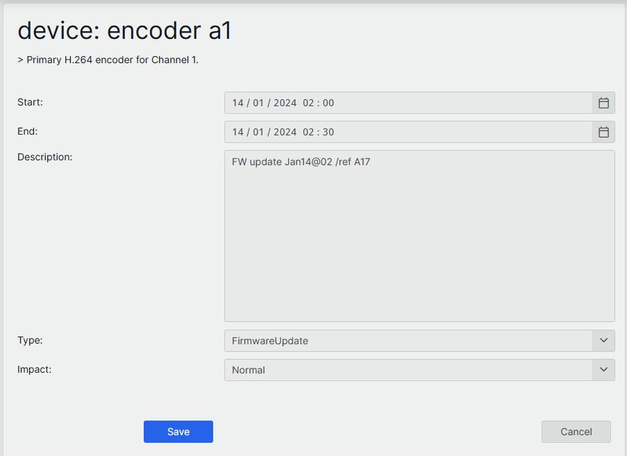

The goal is to:

- Add a dialog. The dialog should have:

  - Two labels to display the name and the description of the **device**.
  - For the maintenance window properties:
    - A label and a calendar or time component for the **start** time.
    - A label and a calendar or time component for the **end** time.
    - A label and a textbox component for the **description**.
    - A label and a dropdown component for the **type**.
    - A label and a dropdown component for the **impact**.
  - A Save and a cancel button

- In `ManageMaintenanceController.cs`

  - Hook up the dialog to edit and add a maintenance window.
  - When deleting a maintenance window ask the user for confirmation, before deleting the maintenance window.

    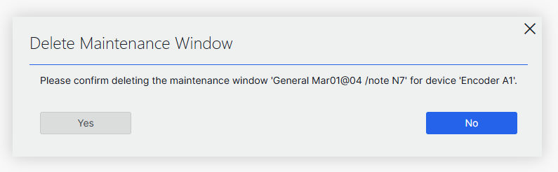

  > To create, update and delete a maintenance window, use the corresponding methods exposed in *repository*. The *repository* represents our in-memory storage.

## The **MaintenanceDialog** class

In the `Manage Maintenance (Learning)` project, the start of the *MaintenanceDialog* class has been prepared. For example `MaintenanceDialog.cs` in `Dialogs/Maintenance`.

- The class inherits from the `Dialog` class available in the `Skyline.DataMiner.Utils.InteractiveAutomationScript` namespace.
- To display the two labels for the name and the description of the *device*, widgets **deviceNameLabel** and **deviceDescriptionLabel** are defined.

   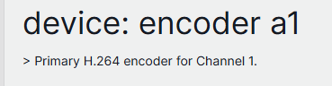

- Two calendar widgets, **startDateBox** and **endDateBox**, are defined to display the *start* and *end* time.

   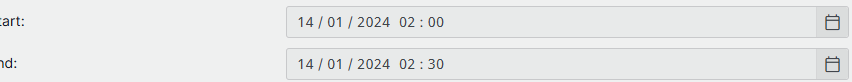

- The textbox widget, **descriptionTextBox**, is defined for the *description*.

   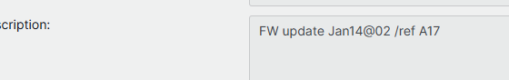

- To select the *type* and *impact*, the widgets **typeDropDown** and **impactDropDown** have been defined. Those are of type *EnumDropDown* so they will automatically prefill the values of their enums as the options in the dropdown.

   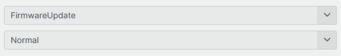

- The other widgets are not needed later when loading or saving the date, so they will be defined later on.

> Note that in this dialog no widgets need to be repositioned. When that would be the case the dialog should be rebuild on every load. See `MaintenanceOverviewDialog.cs` for an example.

## Display the device information

Let's start hooking up the dialog by first displaying the device information.

1. Add the widgets for the name and description of the device.
   In `MaintenanceDialog.cs` (`Manage Maintenance (Learning)\Dialogs\Maintenance`), the `MaintenanceDialog(IEngine engine)` constructor should look like:

   ```csharp
   public MaintenanceDialog(IEngine engine) : base(engine)
   {
       var row = 0;

       // Create and add widgets for device information.
       deviceNameLabel = new Label { Style = TextStyle.Title };
       AddWidget(deviceNameLabel, row++, 0, 1, 2);

       deviceDescriptionLabel = new Label();
       AddWidget(deviceDescriptionLabel, row++, 0, 1, 2);
   }
   ```

1. Add a public method that can be used to **Load** the device and maintenance window data.

    In `MaintenanceDialog.cs` (`Manage Maintenance (Learning)\Dialogs\Maintenance`), under the `MaintenanceDialog(IEngine engine)` constructor the `Load` method should look like:

   ```csharp
   public void Load(Device device, MaintenanceWindow window)
   {
       deviceNameLabel.Text = $"Device: {device?.Name}";
       deviceDescriptionLabel.Text = $"> {device?.Description}";
   }
   ```

1. In `ManageMaintenanceController.cs`, we need hook up the dialog to edit a maintenance window.
   - Look for the `EditMaintenanceWindow` method.
   - We'll initialize the dialog that we have extended previously.
   - Load the device and maintenance window data that we got from the main dialog.
   - We'll switch the controller to the maintenance dialog.
   - In `ManageMaintenanceController.cs` (`Manage Maintenance (Learning)`), the `EditMaintenanceWindow` method should look like:

     ```csharp
     private void EditMaintenanceWindow(Device device, MaintenanceWindow maintenanceWindow)
     {
         var maintenanceDialog = new MaintenanceDialog(engine);
         maintenanceDialog.Load(device, maintenanceWindow);
         controller.ShowDialog(maintenanceDialog);
     }
     ```

1. Let's check if we can already see that information when a maintenance window get's edited.
   - Open the `Manage Maintenance (Learning).xml` and click the *Publish* button to publish the script.
   - When the package has been uploaded and deployed, return to the *Manage Maintenance windows* app in your browser and **refresh** the app.
   - Select the first device.
   - When clicking the **Edit** button next to one of the maintenance windows you should see the following dialog:

     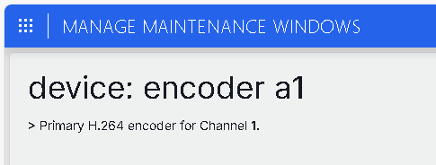

     You'll notice that you're not able to return to the main dialog, since there are no input components available. When you refresh the app, the script execution will abort and you'll return to then main dialog again.

### Load the maintenance windows data

Next up we want the maintenance window data to be displayed.

1. Open `MaintenanceDialog.cs` (`Manage Maintenance (Learning)\Dialogs\Maintenance`), find the `MaintenanceDialog(IEngine engine)` constructor you can extend it like this, for example:

   ```csharp
   public MaintenanceDialog(IEngine engine) : base(engine)
   {
       var row = 0;

       // Create and add widgets for device information.
       deviceNameLabel = new Label { Style = TextStyle.Title };
       AddWidget(deviceNameLabel, row++, 0, 1, 2);

       deviceDescriptionLabel = new Label();
       AddWidget(deviceDescriptionLabel, row++, 0, 1, 2);

       // Add a line of white space between the device info and inputs.
       AddWidget(new WhiteSpace(), row++, 0);

       // We'll add a label on column 0 and the input on column 1.
       AddWidget(new Label("Start:"), row, 0);
       startDateBox = new Calendar();
       AddWidget(startDateBox, row++, 1);

       AddWidget(new Label("End:"), row, 0);
       endDateBox = new Calendar();
       AddWidget(endDateBox, row++, 1);

       AddWidget(new Label("Description:"), row, 0, verticalAlignment: VerticalAlignment.Top);
       descriptionTextBox = new TextBox { IsMultiline = true };
       AddWidget(descriptionTextBox, row++, 1);

       AddWidget(new Label("Type:"), row, 0);
       typeDropDown = new EnumDropDown<MaintenanceWindowType>();
       AddWidget(typeDropDown, row++, 1);

       AddWidget(new Label("Impact:"), row, 0);
       impactDropDown = new EnumDropDown<MaintenanceWindowImpact>();
       AddWidget(impactDropDown, row++, 1);
   }
   ```

1. In `MaintenanceDialog.cs` (`Manage Maintenance (Learning)\Dialogs\Maintenance`), the `MaintenanceDialog(IEngine engine)` search for the `Load` method.
   We'll update the value of each input to what is set in the *MaintenanceWindow* object.

   ```csharp
   public void Load(Device device, MaintenanceWindow window)
   {
       deviceNameLabel.Text = $"Device: {device?.Name}";
       deviceDescriptionLabel.Text = $"> {device?.Description}";

       // Set the value of each input to the value in *window*.
       startDateBox.DateTime = window.Start;
       endDateBox.DateTime = window.End;
       descriptionTextBox.Text = window.Description;
       typeDropDown.Selected = window.Type;
       impactDropDown.Selected = window.Impact;
   }
   ```

1. Let's check again, if we can see the input widgets when a maintenance window get's edited.
   - Open the `Manage Maintenance (Learning).xml` and click the *Publish* button to publish the script.
   - When the package has been uploaded and deployed, return to the *Manage Maintenance windows* app in your browser and **refresh** the app.
   - Select the first device.
   - When clicking the **Edit** button next to one of the maintenance windows you should see the following dialog:

     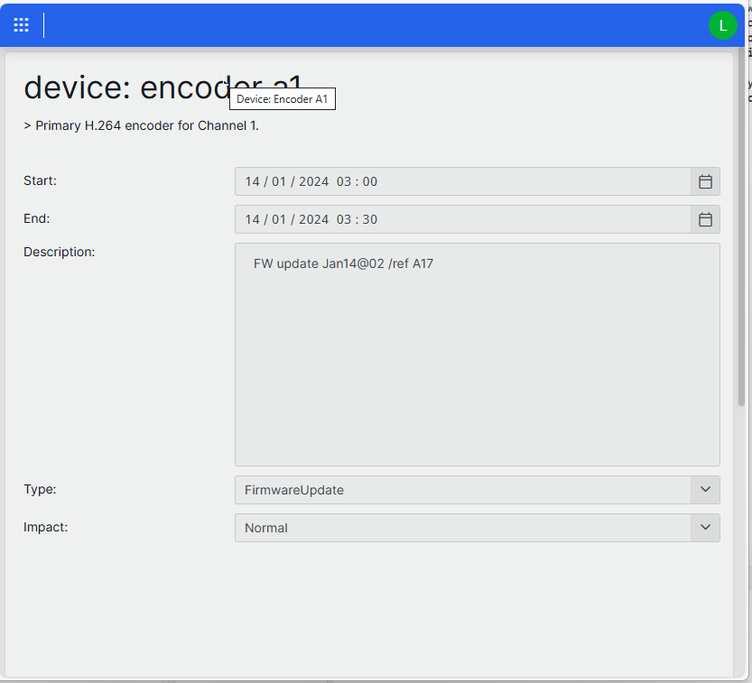

     You'll notice again that you're not able to return to the main dialog, since there are no buttons available yet. Let's add those now.

### Store the updated information

Next up we want to store the maintenance window data that we have changed. Or cancel and immediately return to then main dialog.

1. In `MaintenanceDialog.cs` (`Manage Maintenance (Learning)\Dialogs\Maintenance`), add two events, so the controller is able to act when the dialog gets saved or cancel. You can add them between the `MaintenanceDialog(IEngine engine)` constructor and the `Load` method.

   ```csharp
   /// <summary>
   /// Occurs when the user clicks the Save button to save the maintenance window.
   /// </summary>
   public event EventHandler SaveMaintenance;
   
   /// <summary>
   /// Occurs when the user clicks the Cancel button to close the dialog without saving.
   /// </summary>
   public event EventHandler Cancel;
   ```

1. In `MaintenanceDialog.cs` (`Manage Maintenance (Learning)\Dialogs\Maintenance`), find the `MaintenanceDialog(IEngine engine)` constructor. At the end of the constructor you can add something like:

   ```csharp
   // Add the *Save* button at column 0.
   var saveButton = new Button("Save") { Style = ButtonStyle.CallToAction, Width = 100 };
   saveButton.Pressed += (sender, args) => SaveMaintenance?.Invoke(this, EventArgs.Empty);
   AddWidget(saveButton, row, 0, HorizontalAlignment.Right);

   // Add the *Cancel* button on column 1.
   var cancelButton = new Button("Cancel") { Width = 100 };
   cancelButton.Pressed += (sender, args) => Cancel?.Invoke(this, EventArgs.Empty);
   AddWidget(cancelButton, row, 1, HorizontalAlignment.Right);
   ```

1. In `MaintenanceDialog.cs` (`Manage Maintenance (Learning)\Dialogs\Maintenance`), add the `Store` method. Under the `Load` method for instance.

   ```csharp
   public void Store(MaintenanceWindow window)
   {
       window.Start = startDateBox.DateTime.ToUniversalTime();
       window.End = endDateBox.DateTime.ToUniversalTime();
       window.Description = descriptionTextBox.Text;
       window.Type = typeDropDown.Selected;
       window.Impact = impactDropDown.Selected;
   }
   ```

1. In `ManageMaintenanceController.cs`, we'll now hook up the events when displaying the dialog.
   - Look for the `EditMaintenanceWindow` method.
   - After loading the device and maintenance window data that we got from the main dialog, add the event:
     - When the save event is triggered:
       - store the user input,
       - update the maintenance window in the in-memory storage (*repository*),
       - and reload and switch to the main dialog. You can use `ShowMaintenanceOverview` for that.
     - When the cancel event is triggered, immediately switch to the main dialog.
   - After that, we'll switch the controller to the maintenance dialog.
   - In `ManageMaintenanceController.cs` (`Manage Maintenance (Learning)`), the `EditMaintenanceWindow` method should look like:

     ```csharp
     private void EditMaintenanceWindow(Device device, MaintenanceWindow maintenanceWindow)
     {
         var maintenanceDialog = new MaintenanceDialog(engine);
         maintenanceDialog.Load(device, maintenanceWindow);

         // Handle the Save event.
         maintenanceDialog.SaveMaintenance += (sender, args) =>
         {
             maintenanceDialog.Store(maintenanceWindow);
             repository.UpdateMaintenance(maintenanceWindow);
             ShowMaintenanceOverview();
         };

         // Handle the Cancel event.
         maintenanceDialog.Cancel += (sender, args) => ShowMaintenanceOverview();

         controller.ShowDialog(maintenanceDialog);
     }
     ```

1. When a maintenance window get's edited now it should be possible to save or close the dialog.
   - Open the `Manage Maintenance (Learning).xml` and click the *Publish* button to publish the script.
   - When the package has been uploaded and deployed, return to the *Manage Maintenance windows* app in your browser and **refresh** the app.
   - Select the first device.
   - When clicking the **Edit** button next to one of the maintenance windows you should see the following dialog:

     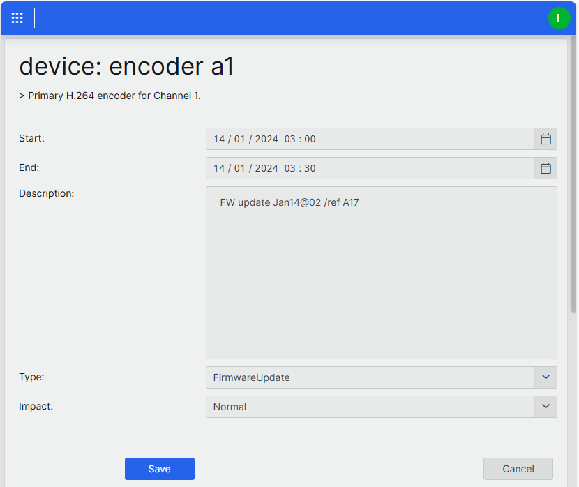

     You should now be able to change the values and save them. Or, by clicking the cancel button, return to the main dialog.

## Delete a maintenance window

When the delete button - next to a maintenance window - is clicked, we want to ask the user for confirmation before deleting the maintenance window.


1. In `ManageMaintenanceController.cs`, we'll now hook up the events when displaying the dialog. Look for the `EditMaintenanceWindow` method.
1. We'll ask the user for confirmation by showing a `YesNoDialog` dialog, provided by the toolkit.
   - If the user confirms the action, delete the maintenance window from the in-memory storage (*repository*).
   - Reload and, if needed, switch to the main dialog. Again, you can use `ShowMaintenanceOverview` for that.
1. In `ManageMaintenanceController.cs` (`Manage Maintenance (Learning)`), the `DeleteMaintenanceWindow` method should look like:

   ```csharp
   private void DeleteMaintenanceWindow(Device device, MaintenanceWindow maintenanceWindow)
   {
       var message = $"Please confirm deleting the maintenance window '{maintenanceWindow.Description}' for device '{device.Name}'.";
       var result = YesNoDialog.Show(engine, message, "Delete Maintenance Window", YesNoDialog.CallToAction.No);
       if (result)
       {
           repository.DeleteMaintenance(maintenanceWindow.Id);
       }

       ShowMaintenanceOverview();
   }
   ```

1. You can publish the script again, to test if the delete button works.
   - Open the `Manage Maintenance (Learning).xml` and click the *Publish* button to publish the script.
   - When the package has been uploaded and deployed, return to the *Manage Maintenance windows* app in your browser and **refresh** the app.
   - Select the first device.
   - When clicking the **Delete** button next to one of the maintenance windows you should see the dialog asking for confirmation.

## Add a maintenance window

When the add button in the header row is clicked, we want to display the *MaintenanceDialog* again. We'll display a new maintenance window in this case.

In `ManageMaintenanceController.cs`, look for the `AddMaintenanceWindow` method. It's already prepared to execute when the *Add* button is clicked.

- Initialize a *MaintenanceDialog* instance.
- Initialize a *MaintenanceWindow* instance and set some default values.
- Load the device and the new maintenance window data.
- When the save event is triggered:
  - store the user input,
  - create the maintenance window in the in-memory storage (*repository*),
  - and reload and switch to the main dialog. You can use `ShowMaintenanceOverview` for that.
- When the cancel event is triggered, immediately switch to the main dialog.
- Switch the controller to the maintenance dialog.
- In `ManageMaintenanceController.cs` (`Manage Maintenance (Learning)`), the `AddMaintenanceWindow` method should look like:

   ```csharp
   private void AddMaintenanceWindow(Device device)
   {
       var maintenanceDialog = new MaintenanceDialog(engine) { Title = "Add Maintenance Window" };
       var maintenanceWindow = new MaintenanceWindow
       {
           Id = Guid.NewGuid(),
           DeviceId = device.Id,
           Start = DateTime.Now.AddDays(1),
           End = DateTime.Now.AddDays(1).AddHours(2),
           Description = string.Empty,
           Type = MaintenanceWindowType.Other,
           Impact = MaintenanceWindowImpact.Normal,
       };
       maintenanceDialog.Load(device, maintenanceWindow);

       // Handle the Save event.
       maintenanceDialog.SaveMaintenance += (sender, args) =>
       {
           maintenanceDialog.Store(maintenanceWindow);
           repository.CreateMaintenance(maintenanceWindow);
           ShowMaintenanceOverview();
       };

        // Handle the Cancel event.
        maintenanceDialog.Cancel += (sender, args) => ShowMaintenanceOverview();

       controller.ShowDialog(maintenanceDialog);
   }
   ```

You can publish the script again, to test if the add button works.

- Open the `Manage Maintenance (Learning).xml` and click the *Publish* button to publish the script.
- When the package has been uploaded and deployed, return to the *Manage Maintenance windows* app in your browser and **refresh** the app.
- Select the first device.
- When clicking the **Add** button next to one of the maintenance windows you should see maintenance dialog again.

## Full example

If you would like to check the code of this exercise you can open the [main branch of the GitHub repo](https://github.com/SkylineCommunications/Skyline.DataMiner.Learning.MakingMaintenanceObservable/tree/main).

- [MaintenanceDialog.cs](https://github.com/SkylineCommunications/Skyline.DataMiner.Learning.MakingMaintenanceObservable/blob/main/Manage%20Maintenance%20(Learning)/Dialogs/Maintenance/MaintenanceDialog.cs)
- [ManageMaintenanceController.cs](https://github.com/SkylineCommunications/Skyline.DataMiner.Learning.MakingMaintenanceObservable/blob/main/Manage%20Maintenance%20(Learning)/ManageMaintenanceController.cs)

You can also get the full example by installing the catalog item: [Making Scripts Interactive and Observable](https://catalog.dataminer.services/details/6e4479b5-d114-471e-bcc4-747ad92a4405).

## References

- Session GitHub repo: [Skyline.DataMiner.Learning.MakingMaintenanceObservable](https://github.com/SkylineCommunications/Skyline.DataMiner.Learning.MakingMaintenanceObservable)
- Toolkit NuGet: [Skyline.DataMiner.Utils.InteractiveAutomationScriptToolkit on the NuGet Gallery](https://www.nuget.org/packages/Skyline.DataMiner.Utils.InteractiveAutomationScriptToolkit)
  - [Getting started on DataMiner Docs](https://docs.dataminer.services/develop/devguide/Automation/Howto/Getting_Started_with_the_IAS_Toolkit.html)
  - [GitHub Repo](https://github.com/SkylineCommunications/Skyline.DataMiner.Utils.InteractiveAutomationScriptToolkit)
  - [MVP on DataMiner Community](https://community.dataminer.services/courses/dataminer-automation/lessons/model-view-presenter/)
- [Skyline DataMiner SDK](https://docs.dataminer.services/develop/CICD/Skyline%20DataMiner%20Software%20Development%20Kit/skyline_dataminer_sdk.html)
- [Automation script development guide on DataMiner Docs](https://docs.dataminer.services/develop/devguide/Automation/index.html)
  - [Launching and attaching interactive automation scripts](https://docs.dataminer.services/develop/devguide/Automation/Howto/Launching_and_attaching_interactive_Automation_scripts.html)
  - [Creating a Cypress test](https://docs.dataminer.services/develop/devguide/Automation/Howto/Creating_a_cypress_test_for_an_interactive_automation_script.html)
