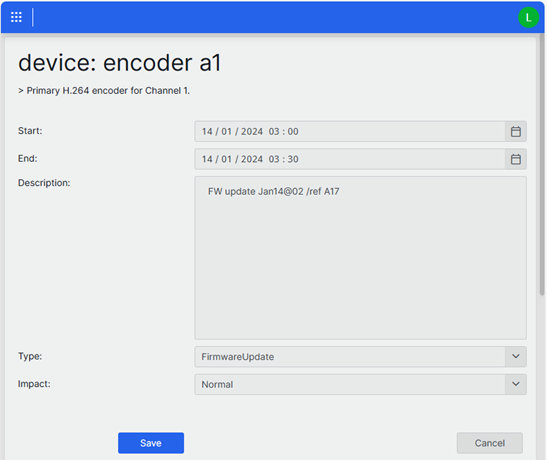

# Making Scripts Interactive and Observable

## About

This package contains a complete, working example of an interactive automation script that demonstrates how to create embedded script interfaces in DataMiner low-code apps using the Interactive Automation Script (IAS) Toolkit.

It includes the following:

- A fully functional maintenance window management script
- A low-code app demonstrating the *Interactive Automation Script* component
- A ready-to-deploy implementation showcasing the IAS Toolkit

You can deploy this package to immediately see and use the complete implementation, or follow the step-by-step tutorial in the [GitHub repository](https://github.com/SkylineCommunications/Skyline.DataMiner.Learning.MakingMaintenanceObservable) to build it yourself.

## Key Concepts

### Interactive Automation Script Toolkit

This project uses the [Skyline.DataMiner.Utils.InteractiveAutomationScriptToolkit](https://www.nuget.org/packages/Skyline.DataMiner.Utils.InteractiveAutomationScriptToolkit) NuGet package, which provides:

- Pre-built UI widgets (buttons, labels, text boxes, calendars, dropdowns)
- Dialog management and navigation
- Event handling for user interactions
- Consistent styling and layout

### Making Scripts Interactive

To make a script interactive and embeddable in low-code apps:

1. Add the `<Interactivity>Always</Interactivity>` element to the script XML (DataMiner 10.5.9 or later).
1. Use the IAS Toolkit to build dialogs and handle user interactions.
1. Configure the script as an "Interactive Automation Script" component in low-code apps.

## Prerequisites

- Visual Studio 2022 or Visual Studio 2026
- DataMiner Integration Studio (DIS) extension
- Access to a DataMiner system (DaaS or on-premises)
- Basic knowledge of C# and DataMiner automation scripts

## What You Will Build

A **Maintenance Window Management** application that allows users to:

- View maintenance windows for devices
- Add new maintenance windows
- Edit existing maintenance windows
- Delete maintenance windows with confirmation dialogs


The application demonstrates real-world patterns for building interactive automation scripts that provide a seamless user experience within low-code apps.



## What You Will Learn

The project teaches you how to build interactive automation scripts that can be embedded in low-code apps as components. Through a practical example of a maintenance window management system, you will learn how to:

- Create interactive dialog boxes with various UI components (labels, buttons, calendars, dropdowns, text boxes)
- Implement the Model-View-Presenter (MVP) pattern for automation scripts
- Handle user interactions and events
- Manage application state with in-memory storage
- Integrate scripts as components in DataMiner low-code apps

## Getting Started

1. **Clone the repository**

   ```bash
   git clone https://github.com/SkylineCommunications/Skyline.DataMiner.Learning.MakingMaintenanceObservable.git
   cd Skyline.DataMiner.Learning.MakingMaintenanceObservable
   ```

1. **Select the appropriate branch**

   - `hands-on`: Starting point for following the tutorial
   - `main`: Complete solution with all features implemented

1. **Open the solution**

   - Open `Skyline.DataMiner.Learning.MakingMaintenanceObservable.sln` in Visual Studio.

1. **Follow the guide**

   - See `Guide.md` for detailed step-by-step instructions.
   - The guide walks you through implementing all features from scratch.

## Learning Path

1. **Start with the hands-on branch** - Clone and check out the `hands-on` branch for a guided learning experience.
1. **Follow the Guide** - Work through [Guide.md](https://github.com/SkylineCommunications/Skyline.DataMiner.Learning.MakingMaintenanceObservable/blob/HEAD/Guide.md) step by step.
1. **Build incrementally** - Each section builds upon the previous one.
1. **Test frequently** - Publish to your DataMiner system and test in a low-code app.
1. **Compare with main** - Check the `main` branch to see the complete implementation.

## Note on Data Persistence

The data in this learning project is stored **in memory only**. When the script restarts, all changes are lost and the original demo data is restored. This is intentional for learning purposes. In a production scenario, you would persist data to a database, parameters, or other storage.

## Contributing

This is a learning resource maintained by Skyline Communications. For issues or suggestions, please refer to the [GitHub repository](https://github.com/SkylineCommunications/Skyline.DataMiner.Learning.MakingMaintenanceObservable).

## License

This project is provided as a learning resource for the DataMiner community and is licensed under the MIT License - see the [LICENSE](https://github.com/SkylineCommunications/Skyline.DataMiner.Learning.MakingMaintenanceObservable/blob/HEAD/LICENSE) file for details.
